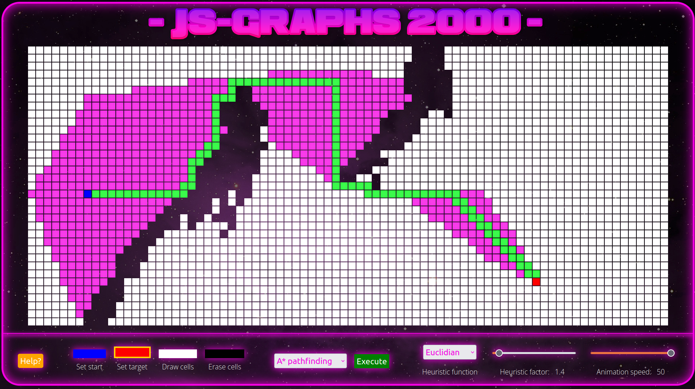

# What is JS-Graphs?
JS-Graphs is a playground for pathfinding algorithms using simple `JS`, `HTML` and `CSS` code that. In this playground you can execute different pathfinding algorithms on a grid layout. Is is also possible to draw on the grid, move start/target position, and generate grid-layouts.

# Installation
1. Clone or download repo
2. Navigate to `index.html`
3. Open in desired browser

# Requirements
1. A somewhat modern browser
2. A screen of reasonable size

# Example images

